# FlexUI

ロールアウトコントロールをフレキシブルに配置するためのフレームワーク。

## 特徴

* Qtライクな使用感。

* 24種類のロールアウトコントロールに対応。
  （`comboBox`と`timer`は非対応）

* `progressBar`や`spinner`等、通常はサイズ変更できないコントロールもサイズ変更可能。

## サンプル

* ウィジェット（`FlexUI\Example\Widget\FlexEditTextControlWidget.ms`）

  

* レイアウト（`FlexUI\Example\Layout\FlexGridLayout.ms`）

  

* 電卓（`FlexUI\Example\Calc.ms`）

  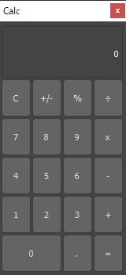

* エクスプローラ（`FlexUI\Example\Explorer.ms`）

  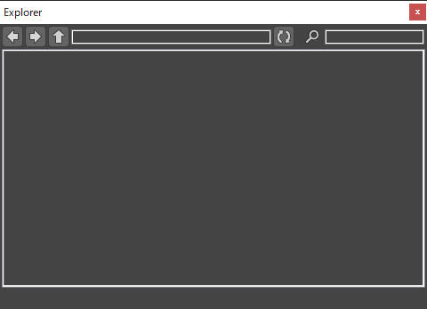

* フォーム（`FlexUI\Example\Form.ms`）

  

## 要件

* [imaoki/Standard](https://github.com/imaoki/Standard)

  テストおよびサンプルでのみ利用。

## 動作確認

`3ds Max 2022.3 Update`

## インストール

01. 依存スクリプトがある場合は予めインストールしておく。

02. `install.ms`を実行する。

## アンインストール

`uninstall.ms`を実行する。

## スタンドアローン版

### インストール

01. 依存スクリプトがある場合は予めインストールしておく。

02. `Distribution\FlexUI.min.ms`を実行する。

### アンインストール

```maxscript
::flexUI.Uninstall()
```

## 使い方

### ウィジェット

* ウィジェットは全種類が共通のプロパティとメソッドを持つ。

* 既定のサイズ、最小サイズ、およびリサイズの可/不可はロールアウトコントロールの特性に合わせて定数として定義されている。

```maxscript
(
  local widget = ::flexUI.CreateWidget Edt

  -- 全体の水平方向の位置合わせ
  widget.SetAlignmentH #Center

  -- 全体の垂直方向の位置合わせ
  widget.SetAlignmentV #Center

  -- キャプションと本体との余白ピクセル
  widget.SetCaptionMargin 3

  -- キャプションの表示位置
  widget.SetCaptionPosition #Left

  -- キャプションを含まない明示的な高さ
  widget.SetExplicitH undefined

  -- キャプションを含まない明示的な幅
  widget.SetExplicitW undefined

  -- 矩形を設定
  widget.SetRect (Box2 0 0 100 100)
)
```

### レイアウト

#### Gridレイアウト

* 仮想のグリッド上にアイテムを配置するレイアウト。

* グリッドの数は必要に応じて自動的に拡張される。

```maxscript
(
  -- レイアウトオプションは任意で指定する
  local layoutOptions = ::flexUI.CreateLayoutOptions()
  local gridLayout = ::flexUI.CreateGridLayout options:layoutOptions

  -- レイアウトを追加（開始行、開始列の順）
  gridLayout.AddLayout vBoxLayout 1 1

  -- ウィジェットを追加（開始行、開始列、専有する行数、専有する列数の順）
  gridLayout.AddWidget widget 2 3 rowSpan:1 columnSpan:3

  -- 行の最小高を設定（行、高さの順）
  gridLayout.SetRowMinimumHeight 1 10

  -- 列の最小幅を設定（列、幅の順）
  gridLayout.SetColumnMinimumWidth 2 10

  -- 行のストレッチ係数を設定（行、ストレッチ係数の順）
  gridLayout.SetRowStretch 2 2

  -- 列のストレッチ係数を設定（列、ストレッチ係数の順）
  gridLayout.SetColumnStretch 3 2

  -- 行を固定長にする（行、固定長の順）
  gridLayout.SetRowFixedLength 1 20

  -- 列を固定長にする（列、固定長の順）
  gridLayout.SetColumnFixedLength 1 20

  -- 矩形を設定
  gridLayout.SetRect (Box2 0 0 100 100)
)
```

#### Groupレイアウト

* `GroupBoxControl`用のレイアウト。

```maxscript
(
  local groupBoxWidget = ::flexUI.CreateWidget Gbx
  local groupLayout = ::flexUI.CreateGroupLayout groupBoxWidget

  -- レイアウトまたはウィジェットを追加
  groupLayout.SetCell widget

  -- 矩形を設定
  groupLayout.SetRect (Box2 0 0 100 100)
)
```

#### HBoxレイアウト

* 水平方向にアイテムを配置するレイアウト。

```maxscript
(
  -- レイアウトオプションは任意で指定する
  local layoutOptions = ::flexUI.CreateLayoutOptions()
  local hBoxLayout = ::flexUI.CreateHBoxLayout options:layoutOptions

  -- レイアウトを追加（ストレッチ係数は既定の`1`）
  hBoxLayout.AddLayout groupLayout

  -- 固定スペースを追加
  hBoxLayout.AddSpace 10

  -- ストレッチを追加（ストレッチ係数`2`）
  hBoxLayout.AddStretch stretch:2

  -- ウィジェットを追加（ストレッチ係数`3`）
  hBoxLayout.AddWidget widget stretch:1

  -- レイアウトを固定長で追加
  hBoxLayout.AddLayout groupLayout fixedLength:20

  -- ウィジェットを固定長で追加
  hBoxLayout.AddWidget widget fixedLength:20

  -- 矩形を設定
  hBoxLayout.SetRect (Box2 0 0 100 100)
)
```

#### VBoxレイアウト

* 垂直方向にアイテムを配置するレイアウト。

* メソッドはHBoxレイアウトと共通。

```maxscript
(
  -- レイアウトオプションは任意で指定する
  local layoutOptions = ::flexUI.CreateLayoutOptions()
  local vBoxLayout = ::flexUI.CreateVBoxLayout options:layoutOptions

  -- 矩形を設定
  vBoxLayout.SetRect (Box2 0 0 100 100)
)
```

## 制限

* `RolloutFloater`には非対応。

  `Resized`イベントの発生するダイアログでのみ使用可能。

* `FlexComboBoxControlWidgetStruct`は`dropDownList`にのみ対応する。
  `comboBox`には非対応。

* `curveControl`のサイズ変更には非対応。

* `slider`の`orient`パラメータは`#Horizontal`にのみ対応。

## 補足情報

### グローバル変数

* 通常はグローバル変数`::flexUI`を通して操作する。

* 詳細は[`mxsdoc.FlexUI.ms`](https://imaoki.github.io/mxskb/mxsdoc/flexui-flexui.html)を参照。

### ウィジェットの種類

| ウィジェット                                                                                                                    | コントロール     | 幅   | 高   | 画像                                                                                                         |
| ------------------------------------------------------------------------------------------------------------------------------- | ---------------- | ---- | ---- | ------------------------------------------------------------------------------------------------------------ |
| [`FlexAngleControlWidgetStruct`](https://imaoki.github.io/mxskb/mxsdoc/flexui-model-widget-flexanglecontrolwidget.html)               | `angle`          | 可変 | 可変 | 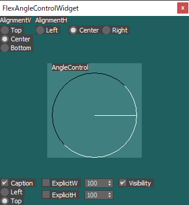                      |
| [`FlexBitmapControlWidgetStruct`](https://imaoki.github.io/mxskb/mxsdoc/flexui-model-widget-flexbitmapcontrolwidget.html)             | `bitmap`         | 可変 | 可変 | 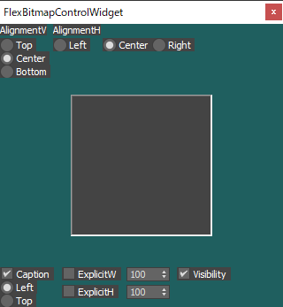                   |
| [`FlexButtonControlWidgetStruct`](https://imaoki.github.io/mxskb/mxsdoc/flexui-model-widget-flexbuttoncontrolwidget.html)             | `button`         | 可変 | 可変 | 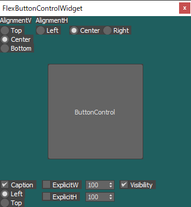                   |
| [`FlexCheckBoxControlWidgetStruct`](https://imaoki.github.io/mxskb/mxsdoc/flexui-model-widget-flexcheckboxcontrolwidget.html)         | `checkBox`       | 固定 | 固定 | 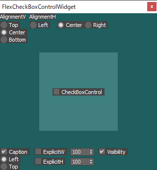             |
| [`FlexCheckButtonControlWidgetStruct`](https://imaoki.github.io/mxskb/mxsdoc/flexui-model-widget-flexcheckbuttoncontrolwidget.html)   | `checkButton`    | 可変 | 可変 | 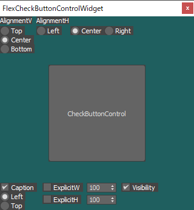    |
| [`FlexColorPickerControlWidgetStruct`](https://imaoki.github.io/mxskb/mxsdoc/flexui-model-widget-flexcolorpickercontrolwidget.html)   | `colorPicker`    | 可変 | 可変 | 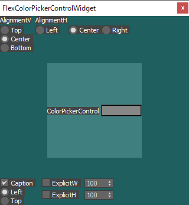    |
| [`FlexComboBoxControlWidgetStruct`](https://imaoki.github.io/mxskb/mxsdoc/flexui-model-widget-flexcomboboxcontrolwidget.html)         | `dropDownList`   | 可変 | 固定 | 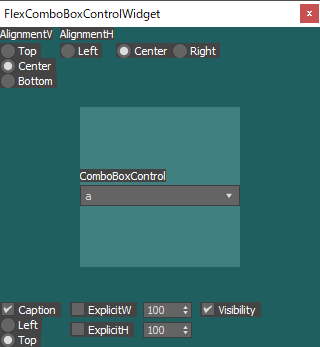             |
| [`FlexDotNetControlWidgetStruct`](https://imaoki.github.io/mxskb/mxsdoc/flexui-model-widget-flexdotnetcontrolwidget.html)             | `dotNetControl`  | 可変 | 可変 | 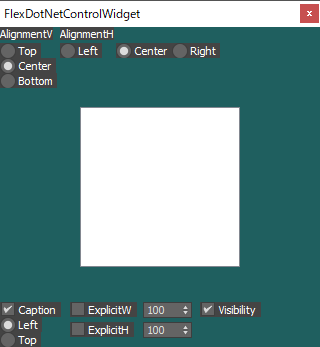                   |
| [`FlexEditTextControlWidgetStruct`](https://imaoki.github.io/mxskb/mxsdoc/flexui-model-widget-flexedittextcontrolwidget.html)         | `editText`       | 可変 | 可変 |              |
| [`FlexGroupBoxControlWidgetStruct`](https://imaoki.github.io/mxskb/mxsdoc/flexui-model-widget-flexgroupboxcontrolwidget.html)         | `groupBox`       | 可変 | 可変 | 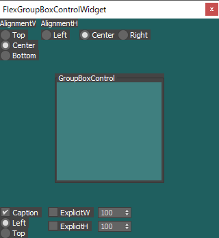             |
| [`FlexImgTagWidgetStruct`](https://imaoki.github.io/mxskb/mxsdoc/flexui-model-widget-fleximgtagwidget.html)                           | `imgTag`         | 可変 | 可変 | 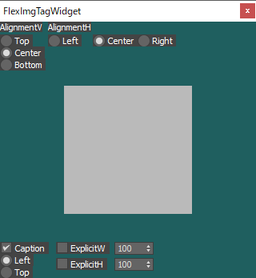                                        |
| [`FlexLabelControlWidgetStruct`](https://imaoki.github.io/mxskb/mxsdoc/flexui-model-widget-flexlabelcontrolwidget.html)               | `label`          | 固定 | 固定 | 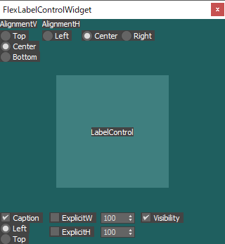                      |
| [`FlexLinkControlWidgetStruct`](https://imaoki.github.io/mxskb/mxsdoc/flexui-model-widget-flexlinkcontrolwidget.html)                 | `hyperLink`      | 固定 | 固定 | 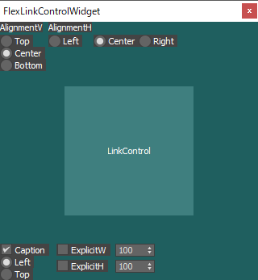                         |
| [`FlexListBoxControlWidgetStruct`](https://imaoki.github.io/mxskb/mxsdoc/flexui-model-widget-flexlistboxcontrolwidget.html)           | `listBox`        | 可変 | 可変 |                 |
| [`FlexMapButtonControlWidgetStruct`](https://imaoki.github.io/mxskb/mxsdoc/flexui-model-widget-flexmapbuttoncontrolwidget.html)       | `mapButton`      | 可変 | 可変 |           |
| [`FlexMaxCurveCtlWidgetStruct`](https://imaoki.github.io/mxskb/mxsdoc/flexui-model-widget-flexmaxcurvectlwidget.html)                 | `curveControl`   | 固定 | 固定 | 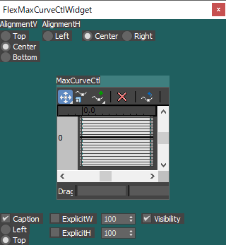                         |
| [`FlexMtlButtonControlWidgetStruct`](https://imaoki.github.io/mxskb/mxsdoc/flexui-model-widget-flexmtlbuttoncontrolwidget.html)       | `materialButton` | 可変 | 可変 | 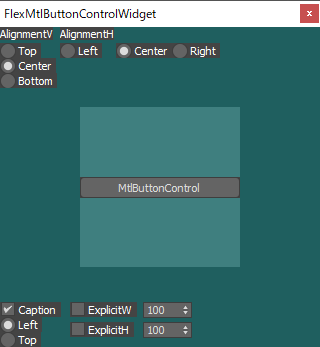          |
| [`FlexMultiListBoxControlWidgetStruct`](https://imaoki.github.io/mxskb/mxsdoc/flexui-model-widget-flexmultilistboxcontrolwidget.html) | `multiListBox`   | 可変 | 可変 | 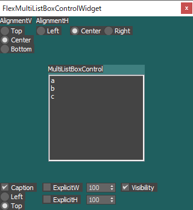 |
| [`FlexPickerControlWidgetStruct`](https://imaoki.github.io/mxskb/mxsdoc/flexui-model-widget-flexpickercontrolwidget.html)             | `pickButton`     | 可変 | 可変 |                    |
| [`FlexProgressBarWidgetStruct`](https://imaoki.github.io/mxskb/mxsdoc/flexui-model-widget-flexprogressbarwidget.html)                 | `progressBar`    | 可変 | 可変 | 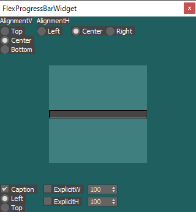                         |
| [`FlexRadioControlWidgetStruct`](https://imaoki.github.io/mxskb/mxsdoc/flexui-model-widget-flexradiocontrolwidget.html)               | `radioButtons`   | 可変 | 可変 | 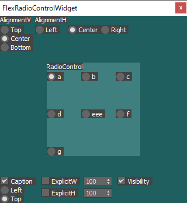                      |
| [`FlexSliderControlWidgetStruct`](https://imaoki.github.io/mxskb/mxsdoc/flexui-model-widget-flexslidercontrolwidget.html)             | `slider`         | 可変 | 固定 | 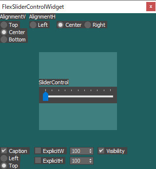                   |
| [`FlexSpinnerControlWidgetStruct`](https://imaoki.github.io/mxskb/mxsdoc/flexui-model-widget-flexspinnercontrolwidget.html)           | `spinner`        | 可変 | 固定 | 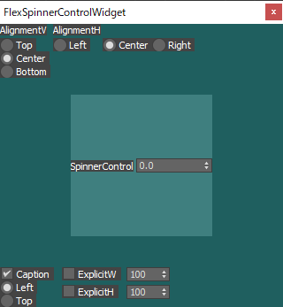                |
| [`FlexSubRolloutWidgetStruct`](https://imaoki.github.io/mxskb/mxsdoc/flexui-model-widget-flexsubrolloutwidget.html)                   | `subRollout`     | 可変 | 可変 | 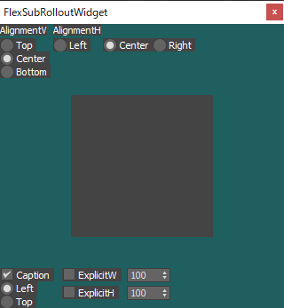                            |

### レイアウトの種類

| レイアウト                                                                                          | 説明                            | 画像                                                               |
| --------------------------------------------------------------------------------------------------- | ------------------------------- | ------------------------------------------------------------------ |
| [`FlexGridLayoutStruct`](https://imaoki.github.io/mxskb/mxsdoc/flexui-model-layout-flexgridlayout.html)   | グリッドにアイテムを配置する    |     |
| [`FlexGroupLayoutStruct`](https://imaoki.github.io/mxskb/mxsdoc/flexui-model-layout-flexgrouplayout.html) | `GroupBoxControl`用のレイアウト | 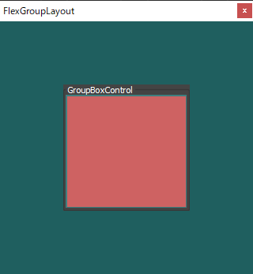 |
| [`FlexHBoxLayoutStruct`](https://imaoki.github.io/mxskb/mxsdoc/flexui-model-layout-flexhboxlayout.html)   | 水平方向にアイテムを配置する    | 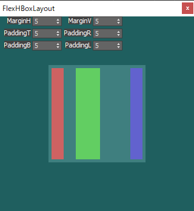    |
| [`FlexVBoxLayoutStruct`](https://imaoki.github.io/mxskb/mxsdoc/flexui-model-layout-flexvboxlayout.html)   | 垂直方向にアイテムを配置する    | 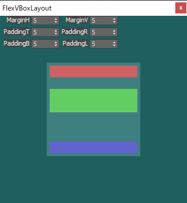    |

### レイアウトオプション

* レイアウト各部の余白を設定する。

* 詳細は[`mxsdoc.FlexLayoutOptions.ms`](https://imaoki.github.io/mxskb/mxsdoc/flexui-model-layout-flexlayoutoptions.html)を参照。

```maxscript
(
  local layoutOptions = ::flexUI.CreateLayoutOptions()

  -- セル間の水平方向の余白
  layoutOptions.SetMarginH 0

  -- セル間の垂直方向の余白
  layoutOptions.SetMarginV 0

  -- レイアウト外周の下側の余白
  layoutOptions.SetPaddingB 0

  -- レイアウト外周の左側の余白
  layoutOptions.SetPaddingL 0

  -- レイアウト外周の右側の余白
  layoutOptions.SetPaddingR 0

  -- レイアウト外周の上側の余白
  layoutOptions.SetPaddingT 0

  -- マージンの一括指定（水平、垂直の順）
  layoutOptions.SetMargin 0 0

  -- パディングの一括指定（上、右、下、左の順）
  layoutOptions.SetPadding 0 0 0 0
)
```

## ライセンス

[MIT License](https://github.com/imaoki/FlexUI/blob/main/LICENSE)
