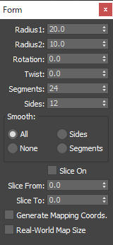
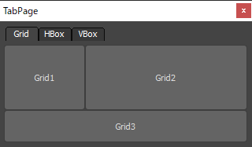
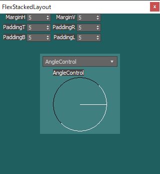

# FlexUI

Framework for flexible placement of rollout controls.
<!-- ロールアウトコントロールをフレキシブルに配置するためのフレームワーク。 -->

## Features
<!-- 特徴 -->

* Controls that normally cannot be resized can be resized.
  <!-- 通常はサイズが変更できないコントロールもサイズ変更が可能。 -->

* Supports 23 types of rollout controls.

  (`comboBox`, `subRollout` and `timer` are not supported)
  <!-- 23種のロールアウトコントロールに対応。 -->
  <!-- （`comboBox`、`subRollout`、`timer`は非対応） -->

## Examples
<!-- 例 -->

* Widget(`Example\Widget\FlexEditTextControlWidget.ms`)

  

* Layout(`Example\Layout\FlexGridLayout.ms`)

  

* Calc(`Example\Calc.ms`)

  

* Explorer(`Example\Explorer.ms`)

  

* Form(`Example\Form.ms`)

  

* TabPage(`Example\TabPage.ms`)

  

## Requirements
<!-- 要件 -->

* [imaoki/Standard](https://github.com/imaoki/Standard)

  Used for testing and examples only.
  <!-- テストおよび例でのみ利用。 -->

## Development Environment
<!-- 開発環境 -->

`3ds Max 2022.3 Update`

## Install
<!-- インストールする -->

01. Dependent scripts should be installed beforehand.
    <!-- 依存スクリプトは予めインストールしておく。 -->

02. Execute `install.ms`.
    <!-- `install.ms`を実行する。 -->

## Uninstall
<!-- アンインストールする -->

Execute `uninstall.ms`.
<!-- `uninstall.ms`を実行する。 -->

## Standalone version
<!-- スタンドアローン版 -->

### Install
<!-- インストールする -->

01. Dependent scripts should be installed beforehand.
    <!-- 依存スクリプトは予めインストールしておく。 -->

02. Execute `Distribution\FlexUI.min.ms`.
    <!-- `Distribution\FlexUI.min.ms`を実行する。 -->

### Uninstall
<!-- アンインストールする -->

```maxscript
::flexUI.Uninstall()
```

## Usage
<!-- 使い方 -->

### Widget

* All types of widgets have common properties and methods.
  <!-- ウィジェットは全種類が共通のプロパティとメソッドを持つ。 -->

* Default size, minimum size, and resizable/unresizable are defined as constants according to the characteristics of the rollout control.
  <!-- 既定のサイズ、最小サイズ、およびリサイズの可/不可はロールアウトコントロールの特性に合わせて定数として定義されている。 -->

```maxscript
(
  local widget = ::flexUI.CreateWidget Edt

  -- Overall horizontal alignment
  widget.SetAlignmentH #Center

  -- Overall vertical alignment
  widget.SetAlignmentV #Center

  -- Margin pixels between caption and body
  widget.SetCaptionMargin 3

  -- Caption placement
  widget.SetCaptionPosition #Left

  -- Explicit height without caption
  widget.SetExplicitH undefined

  -- Explicit width without caption
  widget.SetExplicitW undefined

  -- Set control visibility
  widget.SetVisibility false

  -- Set rectangle
  widget.SetRect (Box2 0 0 100 100)
)
```

### Layout

#### GridLayout

* Layout that places items on a virtual grid.
  <!-- 仮想グリッド上にアイテムを配置するレイアウト。 -->

* Grid automatically expands as needed.
  <!-- グリッドは必要に応じて自動的に拡張される。 -->

```maxscript
(
  -- Layout options are optional
  local layoutOptions = ::flexUI.CreateLayoutOptions()
  local gridLayout = ::flexUI.CreateGridLayout options:layoutOptions

  -- Add layout (row, column)
  gridLayout.AddLayout vBoxLayout 1 1

  -- Add widget (row, column, rowSpan, columnSpan)
  gridLayout.AddWidget widget 2 3 rowSpan:1 columnSpan:3

  -- Set minimum row height (row, height)
  gridLayout.SetRowMinimumHeight 1 10

  -- Set minimum column width (column, width)
  gridLayout.SetColumnMinimumWidth 2 10

  -- Set row stretch factor (row, stretch factor)
  gridLayout.SetRowStretch 2 2

  -- Set column stretch factor (column, stretch factor)
  gridLayout.SetColumnStretch 3 2

  -- Set rows to fixed length (row, fixed length)
  gridLayout.SetRowFixedLength 1 20

  -- Set columns to fixed length (columns, fixed length)
  gridLayout.SetColumnFixedLength 1 20

  -- Set layout visibility
  gridLayout.SetVisibility false

  -- Set rectangle
  gridLayout.SetRect (Box2 0 0 100 100)
)
```

#### GroupLayout

* Layout for `GroupBoxControl`.
  <!-- `GroupBoxControl`用のレイアウト。 -->

```maxscript
(
  -- `GroupBoxControl` widget is required
  local groupBoxWidget = ::flexUI.CreateWidget Gbx
  local groupLayout = ::flexUI.CreateGroupLayout groupBoxWidget

  -- Add a layout or widget
  groupLayout.SetCell widget

  -- Set layout visibility
  groupLayout.SetVisibility false

  -- Set rectangle
  groupLayout.SetRect (Box2 0 0 100 100)
)
```

#### HBoxLayout

* Layout for horizontal item placement.
  <!-- 水平方向にアイテムを配置するレイアウト。 -->

```maxscript
(
  -- Layout options are optional
  local layoutOptions = ::flexUI.CreateLayoutOptions()
  local hBoxLayout = ::flexUI.CreateHBoxLayout options:layoutOptions

  -- Add layout (stretch factor defaults to `1`)
  hBoxLayout.AddLayout groupLayout

  -- Add fixed space
  hBoxLayout.AddSpace 10

  -- Add stretch (stretch factor `2`)
  hBoxLayout.AddStretch stretch:2

  -- Add widget (stretch factor `3`)
  hBoxLayout.AddWidget widget stretch:3

  -- Add layout with fixed length
  hBoxLayout.AddLayout groupLayout fixedLength:20

  -- Add widget with fixed length
  hBoxLayout.AddWidget widget fixedLength:20

  -- Set layout visibility
  hBoxLayout.SetVisibility false

  -- Set rectangle
  hBoxLayout.SetRect (Box2 0 0 100 100)
)
```

#### VBoxLayout

* Layout for vertical item placement.
  <!-- 垂直方向にアイテムを配置するレイアウト。 -->

* Methods are common to HBoxLayout.
  <!-- メソッドはHBoxLayoutと共通。 -->

```maxscript
(
  -- Layout options are optional
  local layoutOptions = ::flexUI.CreateLayoutOptions()
  local vBoxLayout = ::flexUI.CreateVBoxLayout options:layoutOptions

  -- Set rectangle
  vBoxLayout.SetRect (Box2 0 0 100 100)
)
```

#### StackedLayout

* Layout showing only one of the registered items.
  <!-- 登録されたアイテムの内一つのみを表示するレイアウト。 -->

```maxscript
(
  -- Layout options are optional
  local layoutOptions = ::flexUI.CreateLayoutOptions()
  local stackedLayout = ::flexUI.CreateStackedLayout options:layoutOptions

  -- Add layout
  stackedLayout.AddLayout layout

  -- Add widget
  stackedLayout.AddWidget widget

  -- Add layout (specify index to insert)
  stackedLayout.AddLayout layout index:2

  -- Add widget (specify index to insert)
  stackedLayout.AddWidget widget index:2

  -- Set current index
  stackedLayout.SetCurrentIndex 2

  -- Get current index and update control for page switching
  DdlPage.Selection = stackedLayout.GetCurrentIndex()

  -- Set rectangle
  stackedLayout.SetRect (Box2 0 0 100 100)
)
```

## Limitations
<!-- 制限 -->

* Not supported for `RolloutFloater` and `SubRollout`.

  Only available on dialogs with `Resized` events.
  <!-- `RolloutFloater`および`SubRollout`には非対応。 -->
  <!-- `Resized`イベントの発生するダイアログでのみ使用可能。 -->

* `FlexComboBoxControlWidgetStruct` supports only `dropDownList`.

  The `comboBox`, which seems to be used infrequently because it cannot be distinguished from the `dropDownList` at present, was made unsupported.
  <!-- `FlexComboBoxControlWidgetStruct`は`dropDownList`にのみ対応する。 -->
  <!-- 現状では`dropDownList`との判別ができないため使用頻度の低そうな`comboBox`を非対応とした。 -->

* Not supported for `curveControl` resizing.
  <!-- `curveControl`のサイズ変更には非対応。 -->

* The `orient` parameter of `slider` is only supported for `#Horizontal`.
  <!-- `slider`の`orient`パラメータは`#Horizontal`にのみ対応。 -->

## Additional Information
<!-- 追加情報 -->

### Global Variable
<!-- グローバル変数 -->

* Usually, it is operated through the global variable `::flexUI`.
  <!-- 通常はグローバル変数`::flexUI`を通して操作する。 -->

* See [`mxsdoc.FlexUI.ms`](https://imaoki.github.io/mxskb/mxsdoc/flexui-flexui.html) for details.
  <!-- 詳細は[`mxsdoc.FlexUI.ms`](https://imaoki.github.io/mxskb/mxsdoc/flexui-flexui.html)を参照。 -->

### Widget Type
<!-- ウィジェットの種類 -->

| Widget                                                                                                                                | Control Class    | Width    | Height   | Image                                                                                                        |
| ------------------------------------------------------------------------------------------------------------------------------------- | ---------------- | -------- | -------- | ------------------------------------------------------------------------------------------------------------ |
| [`FlexAngleControlWidgetStruct`](https://imaoki.github.io/mxskb/mxsdoc/flexui-model-widget-flexanglecontrolwidget.html)               | `angle`          | Variable | Variable |                       |
| [`FlexBitmapControlWidgetStruct`](https://imaoki.github.io/mxskb/mxsdoc/flexui-model-widget-flexbitmapcontrolwidget.html)             | `bitmap`         | Variable | Variable |                    |
| [`FlexButtonControlWidgetStruct`](https://imaoki.github.io/mxskb/mxsdoc/flexui-model-widget-flexbuttoncontrolwidget.html)             | `button`         | Variable | Variable |                    |
| [`FlexCheckBoxControlWidgetStruct`](https://imaoki.github.io/mxskb/mxsdoc/flexui-model-widget-flexcheckboxcontrolwidget.html)         | `checkBox`       | Fixed    | Fixed    |              |
| [`FlexCheckButtonControlWidgetStruct`](https://imaoki.github.io/mxskb/mxsdoc/flexui-model-widget-flexcheckbuttoncontrolwidget.html)   | `checkButton`    | Variable | Variable |     |
| [`FlexColorPickerControlWidgetStruct`](https://imaoki.github.io/mxskb/mxsdoc/flexui-model-widget-flexcolorpickercontrolwidget.html)   | `colorPicker`    | Variable | Variable |     |
| [`FlexComboBoxControlWidgetStruct`](https://imaoki.github.io/mxskb/mxsdoc/flexui-model-widget-flexcomboboxcontrolwidget.html)         | `dropDownList`   | Variable | Fixed    |              |
| [`FlexDotNetControlWidgetStruct`](https://imaoki.github.io/mxskb/mxsdoc/flexui-model-widget-flexdotnetcontrolwidget.html)             | `dotNetControl`  | Variable | Variable |                    |
| [`FlexEditTextControlWidgetStruct`](https://imaoki.github.io/mxskb/mxsdoc/flexui-model-widget-flexedittextcontrolwidget.html)         | `editText`       | Variable | Variable |              |
| [`FlexGroupBoxControlWidgetStruct`](https://imaoki.github.io/mxskb/mxsdoc/flexui-model-widget-flexgroupboxcontrolwidget.html)         | `groupBox`       | Variable | Variable |              |
| [`FlexImgTagWidgetStruct`](https://imaoki.github.io/mxskb/mxsdoc/flexui-model-widget-fleximgtagwidget.html)                           | `imgTag`         | Variable | Variable |                                         |
| [`FlexLabelControlWidgetStruct`](https://imaoki.github.io/mxskb/mxsdoc/flexui-model-widget-flexlabelcontrolwidget.html)               | `label`          | Fixed    | Fixed    |                       |
| [`FlexLinkControlWidgetStruct`](https://imaoki.github.io/mxskb/mxsdoc/flexui-model-widget-flexlinkcontrolwidget.html)                 | `hyperLink`      | Fixed    | Fixed    |                          |
| [`FlexListBoxControlWidgetStruct`](https://imaoki.github.io/mxskb/mxsdoc/flexui-model-widget-flexlistboxcontrolwidget.html)           | `listBox`        | Variable | Variable |                 |
| [`FlexMapButtonControlWidgetStruct`](https://imaoki.github.io/mxskb/mxsdoc/flexui-model-widget-flexmapbuttoncontrolwidget.html)       | `mapButton`      | Variable | Variable |           |
| [`FlexMaxCurveCtlWidgetStruct`](https://imaoki.github.io/mxskb/mxsdoc/flexui-model-widget-flexmaxcurvectlwidget.html)                 | `curveControl`   | Fixed    | Fixed    |                          |
| [`FlexMtlButtonControlWidgetStruct`](https://imaoki.github.io/mxskb/mxsdoc/flexui-model-widget-flexmtlbuttoncontrolwidget.html)       | `materialButton` | Variable | Variable |           |
| [`FlexMultiListBoxControlWidgetStruct`](https://imaoki.github.io/mxskb/mxsdoc/flexui-model-widget-flexmultilistboxcontrolwidget.html) | `multiListBox`   | Variable | Variable |  |
| [`FlexPickerControlWidgetStruct`](https://imaoki.github.io/mxskb/mxsdoc/flexui-model-widget-flexpickercontrolwidget.html)             | `pickButton`     | Variable | Variable |                    |
| [`FlexProgressBarWidgetStruct`](https://imaoki.github.io/mxskb/mxsdoc/flexui-model-widget-flexprogressbarwidget.html)                 | `progressBar`    | Variable | Variable |                          |
| [`FlexRadioControlWidgetStruct`](https://imaoki.github.io/mxskb/mxsdoc/flexui-model-widget-flexradiocontrolwidget.html)               | `radioButtons`   | Variable | Variable |                       |
| [`FlexSliderControlWidgetStruct`](https://imaoki.github.io/mxskb/mxsdoc/flexui-model-widget-flexslidercontrolwidget.html)             | `slider`         | Variable | Fixed    |                    |
| [`FlexSpinnerControlWidgetStruct`](https://imaoki.github.io/mxskb/mxsdoc/flexui-model-widget-flexspinnercontrolwidget.html)           | `spinner`        | Variable | Fixed    |                 |

### Layout Type
<!-- レイアウトの種類 -->

| Layout                                                                                                        | Description                                     | Image                                                                    |
| ------------------------------------------------------------------------------------------------------------- | ----------------------------------------------- | ------------------------------------------------------------------------ |
| [`FlexGridLayoutStruct`](https://imaoki.github.io/mxskb/mxsdoc/flexui-model-layout-flexgridlayout.html)       | Layout that places items on a virtual grid      |           |
| [`FlexGroupLayoutStruct`](https://imaoki.github.io/mxskb/mxsdoc/flexui-model-layout-flexgrouplayout.html)     | Layout for `GroupBoxControl`                    |        |
| [`FlexHBoxLayoutStruct`](https://imaoki.github.io/mxskb/mxsdoc/flexui-model-layout-flexhboxlayout.html)       | Layout for horizontal item placement            |           |
| [`FlexVBoxLayoutStruct`](https://imaoki.github.io/mxskb/mxsdoc/flexui-model-layout-flexvboxlayout.html)       | Layout for vertical item placement              |           |
| [`FlexStackedLayoutStruct`](https://imaoki.github.io/mxskb/mxsdoc/flexui-model-layout-flexstackedlayout.html) | Layout showing only one of the registered items |  |

### Layout Options
<!-- レイアウトオプション -->

* Set the margins for each part of the layout.
  <!-- レイアウト各部の余白を設定する。 -->

* See [`mxsdoc.FlexLayoutOptions.ms`](https://imaoki.github.io/mxskb/mxsdoc/flexui-model-layout-flexlayoutoptions.html) for details.
  <!-- 詳細は[`mxsdoc.FlexLayoutOptions.ms`](https://imaoki.github.io/mxskb/mxsdoc/flexui-model-layout-flexlayoutoptions.html)を参照。 -->

```maxscript
(
  local layoutOptions = ::flexUI.CreateLayoutOptions()

  -- Horizontal margins between cells
  layoutOptions.SetMarginH 0

  -- Vertical margins between cells
  layoutOptions.SetMarginV 0

  -- Bottom margin of layout
  layoutOptions.SetPaddingB 0

  -- Left margin of layout
  layoutOptions.SetPaddingL 0

  -- Right margin of layout
  layoutOptions.SetPaddingR 0

  -- Top margin of layout
  layoutOptions.SetPaddingT 0

  -- Set margins at once (horizontal, vertical)
  layoutOptions.SetMargin 0 0

  -- Set padding at once (top, right, bottom, left)
  layoutOptions.SetPadding 0 0 0 0
)
```

### Notifications
<!-- 通知 -->

#### Widget

Common to all widgets.
<!-- 全てのウィジェットで共通。 -->

| `params`           | Timing                                              |
| ------------------ | --------------------------------------------------- |
| `#AlignmentH`      | After setting `alignmentH`                          |
| `#AlignmentV`      | After setting `alignmentV`                          |
| `#CaptionMargin`   | After setting `captionMargin`                       |
| `#CaptionPosition` | After setting `captionPosition`                     |
| `#Control`         | After setting `control`                             |
| `#ExplicitH`       | After setting `explicitH`                           |
| `#ExplicitW`       | After setting `explicitW`                           |
| `#RectUpdated`     | After setting the rollout control rectangle         |
| `#Visibility`      | After setting the visibility of the rollout control |

#### Layout

##### FlexGridLayoutStruct

| `params`              | Timing                                  |
| --------------------- | --------------------------------------- |
| `#ColumnFixedLength`  | After setting the fixed width of column |
| `#ColumnMinimumWidth` | After setting the minimum column width  |
| `#ColumnStretch`      | After setting the column stretch factor |
| `#LayoutAdded`        | After adding a layout                   |
| `#RectUpdated`        | After setting the layout rectangle      |
| `#RowFixedLength`     | After setting the fixed height of row   |
| `#RowMinimumHeight`   | After setting the minimum row height    |
| `#RowStretch`         | After setting the row stretch factor    |
| `#VisibilityChanged`  | After setting layout visibility         |
| `#WidgetAdded`        | After adding a widget                   |

##### FlexGroupLayoutStruct

| `params`             | Timing                             |
| -------------------- | ---------------------------------- |
| `#CellSet`           | After setting the cell             |
| `#RectUpdated`       | After setting the layout rectangle |
| `#VisibilityChanged` | After setting layout visibility    |

##### FlexHBoxLayoutStruct

| `params`             | Timing                             |
| -------------------- | ---------------------------------- |
| `#LayoutAdded`       | After adding a layout              |
| `#RectUpdated`       | After setting the layout rectangle |
| `#SpaceAdded`        | After adding fixed space           |
| `#StretchAdded`      | After adding stretchable space     |
| `#VisibilityChanged` | After setting layout visibility    |
| `#WidgetAdded`       | After adding a widget              |

##### FlexVBoxLayoutStruct

Similar to `FlexHBoxLayoutStruct`.
<!-- `FlexHBoxLayoutStruct`と同様。 -->

##### FlexStackedLayoutStruct

| `params`             | Timing                             |
| -------------------- | ---------------------------------- |
| `#CurrentIndex`      | After setting the `currentIndex`   |
| `#LayoutAdded`       | After adding a layout              |
| `#RectUpdated`       | After setting the layout rectangle |
| `#VisibilityChanged` | After setting layout visibility    |
| `#WidgetAdded`       | After adding a widget              |

#### Layout Options

| `params`    | Timing                   |
| ----------- | ------------------------ |
| `#MarginH`  | After setting `marginH`  |
| `#MarginV`  | After setting `marginV`  |
| `#PaddingB` | After setting `paddingB` |
| `#PaddingL` | After setting `paddingL` |
| `#PaddingR` | After setting `paddingR` |
| `#PaddingT` | After setting `paddingT` |

## License
<!-- ライセンス -->

[MIT License](https://github.com/imaoki/FlexUI/blob/main/LICENSE)
